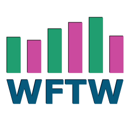

<div align="center">



</div>

---

# Warframe Trade Watch (WFTW)

## What it is

A desktop companion that watches Warframe Market for you and alerts you when matching buy or sell orders appear.

No account. No browser tab. Just passive notifications while you play.

## Download

Pre-release builds are available on the [Releases page](https://github.com/TheOneLeeT/WFTW/releases).

| Platform | Archive | Run |
|----------|---------|-----|
| Windows | `WFTW-windows-x64.zip` | Extract and run `WFTW.exe` |
| macOS | `WFTW-macos-universal.tar.gz` | Extract and run the app |
| Linux | `WFTW-linux-x64.AppImage` | Make executable and run |

> **Note:** Back up your `watchlist.json` and `settings.json` before updating.

## Build from source

```bash
pip install -r requirements.txt
flet build <windows|macos|linux> --module-name gui --yes
```

## Project layout

```
WFTW/
├── gui.py            # Main application UI
├── tracker_core.py   # Scanning engine and API logic
├── requirements.txt  # Python dependencies
├── settings.json     # User settings
├── watchlist.json    # Tracked items
├── notif.json        # Notification preferences
├── Logs/             # Application logs
└── Media/
    └── Icon/         # App icons per platform
```

## Development workflow

- All feature work happens on the **Dev** branch
- When Dev is ready, it is merged into **Main**
- Release builds are compiled from **Main** only

```
Dev  ──►  Main  ──►  Build / Release
```

## Troubleshooting

- **Python not found (Windows)**: use `py gui.py` or add Python to PATH
- **Linux notifications**: install a notification daemon like `dunst` or `xfce4-notifyd`
- **Blank window on Linux**: install `python3-tk` and `libgtk-3-dev`

## Legal

This is a fan-made, non-commercial desktop notification tool. It is not affiliated with, endorsed by, or connected to Digital Extremes Ltd. or warframe.market in any way.
