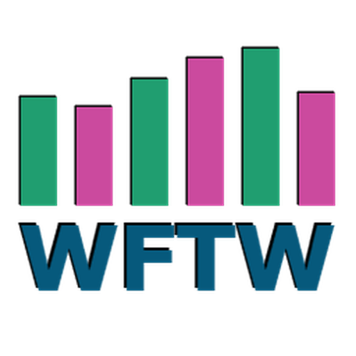

<div align="center">



</div>

---

# Warframe Trade Watch (WFTW)

## What it is

Warframe Trade Watch is a desktop companion that watches Warframe Market for you and instantly alerts you when matching buy or sell orders appear. No account. No browser tab. Just passive notifications while you play.

## Why it exists

Warframe Market is excellent for browsing and trading manually. Warframe Trade Watch complements it by continuously monitoring the public market for the items you care about, so you don't have to refresh pages or keep browser tabs open.

No Warframe Market account required. Warframe Trade Watch monitors public market listings directly, so it works independently of your browser session or Warframe Market login.

## What you get

- **No account required**: monitor public market listings without staying signed in
- **Monitor dozens of items at once**: track multiple buy and sell orders across as many items as you want
- **Runs quietly in the background**: a lightweight tray app that stays out of your way while you play
- **Instant desktop alerts**: know immediately when a matching order appears with sound and notification
- **Available everywhere**: cross-platform desktop app for Windows, macOS, and Linux
- **Private by default**: no telemetry, no cloud sync, and no account creation
- **Responsive while monitoring**: lightweight background polling keeps the interface snappy

## What it tracks

- Sell orders with price and rank filters
- Buy orders with price and rank filters
- Online and in-game status awareness
- Local notifications with customizable sound and volume

## Download

**Pre-release builds are available on the [Releases page](https://github.com/TheOneLeeT/WFTW/releases).**

No Python or extra dependencies required. Just download the archive for your platform, extract it, and run the app.

| Platform | Archive | Contents |
|----------|---------|----------|
| Windows | `WFTW-windows-x64.zip` | Portable app — extract and run `WFTW.exe` |
| macOS | `WFTW-macos-universal.dmg` | Disk image — mount and drag `.app` to `Applications` |
| Linux | `WFTW-linux-x64.tar.gz` | Archive — extract and run the executable |

> **Note:** This is a pre-release. Back up your `watchlist.json` and `settings.json` before updating.

## Build from source

If you want to build the app yourself:

1. Install Python 3.11+
2. `pip install -r requirements.txt`
3. `flet build <windows|macos|linux> --module-name gui --yes`
4. The build output will be in `build/<platform>/`

## Project layout

```
WFTW/
├── gui.py                  # Main application UI
├── tracker_core.py         # Scanning engine and API logic
├── requirements.txt        # Python dependencies
├── settings.json           # User settings
├── watchlist.json          # Tracked items
├── notif.json              # Notification preferences
├── Logs/                   # Application logs
└── Media/
    ├── Icon/
    │   ├── WFTW.ico       # Windows icon
    │   ├── WFTW.icns      # macOS icon
    │   └── WFTW.png       # App logo
    └── Sound/
        ├── Dnotif.wav     # Default notification sound
        └── ...            # Additional alert sounds
```

## Troubleshooting

### "python is not recognized" (Windows)

Python is not in your PATH. Re-run the Python installer and check "Add Python to PATH", or use `py` instead of `python`:
```
py gui.py
```

### "python3: command not found" (macOS/Linux)

Try `python` instead of `python3`, or install Python via your package manager.

### Permission errors when installing

Add the `--user` flag:
```
pip3 install --user -r requirements.txt
```

### App won't start / blank window

Make sure you have a display environment running. On Linux, you may need to install additional dependencies:
```
sudo apt install python3-tk
```

### Notifications not appearing

- Check your system notification settings
- On Linux, ensure you have a notification daemon running (e.g., `dunst`, `xfce4-notifyd`)
- Try adjusting volume in the app settings

## Legal

This project is licensed under the MIT License. See the [LICENSE](LICENSE) file for details.

This is a fan-made, non-commercial desktop notification tool. It is not affiliated with, endorsed by, or connected to Digital Extremes Ltd. or warframe.market in any way.

Warframe is a registered trademark of Digital Extremes Ltd. All game-related content, including item names, images, and terminology, is property of Digital Extremes Ltd.

This tool interacts with the public Warframe Market API. Use of this tool is subject to the [Warframe Market Terms of Service](https://warframe.market/tos) and [Rules](https://docs.warframe.market/docs/rules/overview). Users are responsible for complying with all applicable terms, including rate limits (3 requests per second).

This tool does not automate in-game actions, modify the Warframe client, or interact with Digital Extremes servers. It is a passive notification client for an external community website.

THE SOFTWARE IS PROVIDED "AS IS", WITHOUT WARRANTY OF ANY KIND, EXPRESS OR IMPLIED. USE AT YOUR OWN RISK.
